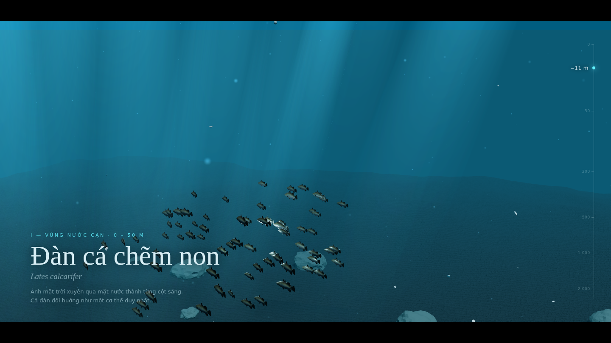
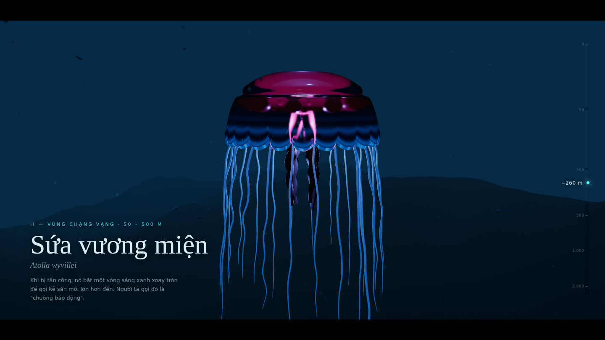
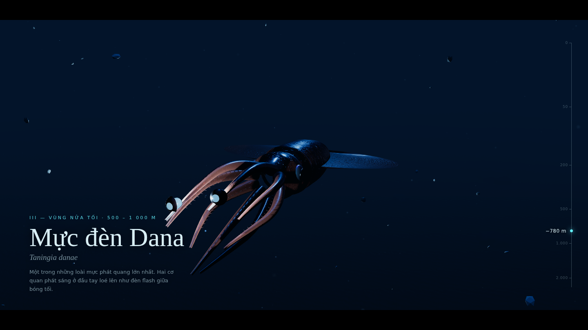
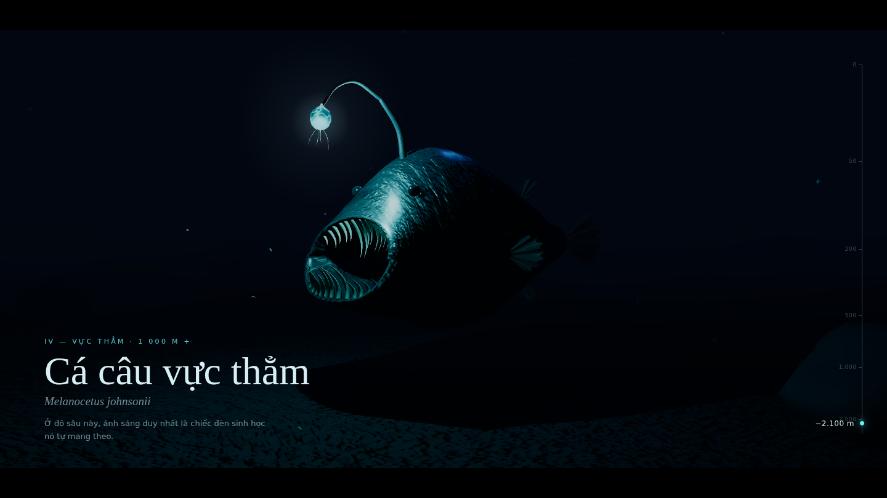

# Abyssal Light — Oceanic Cinema 3D

Một "thước phim tài liệu" 3D về sinh vật biển sâu phát quang, dựng bằng
Vite + React + TypeScript + React Three Fiber.

> **Trạng thái: Bước 2 / 5** — đủ 4 cảnh, cuộn trang để "lặn" từ mặt nước
> xuống vực thẳm; camera bay theo đường định sẵn, có tracking shot bám theo mực.

| I · Nước cạn | II · Chạng vạng | III · Nửa tối | IV · Vực thẳm |
| --- | --- | --- | --- |
|  |  |  |  |

## Chạy

```bash
npm install
npm run dev          # http://localhost:5173
npm run build        # bản production trong dist/
```

Tham số URL hữu ích khi duyệt:

- `?p=0.65` — ghim camera tại một điểm trên đường lặn (0 = mặt nước, 1 = đáy)
- `?quality=low` / `?quality=high` — ép cấu hình di động / desktop
- `?motion=reduced` — giả lập `prefers-reduced-motion`

## Stack

| Việc                   | Thư viện                                          |
| ---------------------- | ------------------------------------------------- |
| Render                 | three r186, @react-three/fiber 9                  |
| Helper                 | @react-three/drei 10 (Environment, ContactShadows, useGLTF, useAnimations, useProgress…) |
| Hậu kỳ (bước 4)        | @react-three/postprocessing 3 + postprocessing 6  |
| Camera theo scroll (bước 2) | GSAP 3 + ScrollTrigger                       |
| State                  | Zustand 5                                         |

## Cuộc lặn

Một giá trị cuộn `p ∈ [0, 1]` (GSAP ScrollTrigger, `scrub`) điều khiển mọi thứ:

| p     | Cảnh | Độ sâu HUD | Sinh vật (key light) |
| ----- | ---- | ---------- | -------------------- |
| 0.10  | I — Vùng nước cạn    | 0–50 m     | Đàn cá chẽm non — mặt trời + ánh bạc phản chiếu theo đàn |
| 0.40  | II — Vùng chạng vạng | 50–500 m   | Sứa vương miện *Atolla wyvillei* — đèn trong chuông |
| 0.53–0.77 | III — Vùng nửa tối | 500–1000 m | Mực đèn Dana *Taningia danae* — 2 cơ quan phát sáng ở đầu tay (tracking shot) |
| 0.92  | IV — Vực thẳm        | 1000 m+    | Cá câu vực thẳm — đèn mồi |

- Bốn vùng xếp chồng theo trục Y (cách nhau 60 đơn vị); sương mù che vùng
  không ở gần camera.
- Camera: spline Catmull-Rom qua danh sách "cảnh quay"; các key "hold" dừng
  êm (ease in/out), đoạn giữa là cú lặn qua cột nước. Thêm lớp làm mượt
  (damping) và độ trôi nhẹ như hơi thở của thợ lặn. Cảnh III hoà trộn sang
  camera bám phía sau–bên trên con mực.
- Môi trường theo độ sâu (`lib/dive.ts`): màu/mật độ sương mù, hemisphere
  light (ánh sáng môi trường giảm dần và lạnh dần), cường độ environment map,
  độ sáng tuyết biển.
- `Zone`: giữ số lượng đèn cố định (không recompile shader khi lặn); đèn của
  vùng xa mờ về 0 và dừng cập nhật shadow map; mesh chuyển sang layer ẩn nên
  camera và shadow camera đều bỏ qua.
- `prefers-reduced-motion`: không bay camera — mỗi cảnh là một cú cắt tĩnh
  vào khung hình chính; sinh vật giữ tư thế tĩnh, đèn thở rất chậm.

## Cấu trúc

```
src/
  creatures/
    CreatureModel.tsx          # loader .glb chung: chuẩn hoá scale, shadow, crossfade clip
    anglerfish/                # cá câu procedural có bộ xương (thân loft + khoang miệng)
    jellyfish/                 # sứa vương miện: chuông mesoglea kín, 23 xúc tu + 4 tay miệng trên chuỗi xương
    squid/                     # mực đèn Dana: áo + vây lớn, 8 tay có móc, 2 cơ quan phát sáng
    fish/FishSchool.tsx        # đàn cá instanced từ BarramundiFish.glb
  scenes/                      # ShallowsScene, TwilightScene, MidnightScene, AbyssScene (+ shallows/ mặt nước, god rays)
  lib/
    noise.ts                   # Perlin 3D, fBm, ridged, profile spline
    geometry.ts                # taperedTube (ống thuôn theo đường cong), fanFin (vây xếp nếp)
    textures.ts                # bake map PBR trên CPU: da, vây, emissive mồi, trầm tích
    bioluminescence.ts         # hàm nhịp sáng sinh học + registry nguồn sáng
    models.ts                  # danh sách sinh vật + tra cứu .glb người dùng
    useProcedural.ts           # build asset procedural trong Suspense + báo tiến độ
  scene/
    Experience.tsx             # Canvas, renderer, shadow map
    CameraRig.tsx              # GSAP ScrollTrigger → spline camera + tracking shot
    Atmosphere.tsx             # sương mù / ánh sáng môi trường / exposure theo độ sâu
    Zone.tsx                   # bật/tắt một vùng mà không đổi số lượng đèn
    AimedLight.tsx             # spot/directional có target nằm trong scene graph
    BioLight.tsx               # PointLight phát quang: nhấp nháy, đổ bóng mềm
    DeepEnvironment.tsx        # environment map xanh sâu (HDR cube dựng bằng Lightformer)
    Seabed.tsx                 # đáy biển displace + đá procedural
    MarineSnow.tsx             # tuyết biển: điểm GPU sáng lên gần nguồn phát quang + mảnh vụn nhận bóng
  state/                       # Zustand: scene/chất lượng/reduced-motion, tiến độ tải
  ui/                          # Loader (tiến độ thật), HUD, bảng duyệt ánh sáng
```

## Model 3D & license

Mạng của môi trường dựng chỉ truy cập được GitHub/npm (Sketchfab, Poly Haven,
Quaternius bị chặn), và không có mô hình cá câu/sứa/mực CC0 nào tải được từ
đó. Vì vậy các sinh vật được **tự dựng bằng procedural geometry nâng cao**
(không phải hình khối cơ bản):

- **Cá câu vực thẳm** — một bề mặt loft liên tục đi từ da ngoài → môi cuộn →
  khoang miệng → họng kín (miệng mở có chiều sâu thật). Silhouette theo
  spline đơn điệu, displace hữu cơ bằng fBm + ridged noise. Bộ xương sinh tự
  động (5 đốt sống + hàm) với trọng số skin mượt. Răng/cần câu/sợi phát quang
  là `taperedTube` theo đường cong Bézier/Catmull-Rom; vây là màng xếp nếp
  theo tia vây với alpha map rách mép; bầu mồi là `LatheGeometry` hình giọt.
- Vật liệu `MeshPhysicalMaterial`: da có clearcoat (nhớt ướt) + sheen (nhung)
  + normal/roughness map bake procedural; vây, răng và bầu mồi dùng
  `transmission + thickness + attenuationColor` để giả lập tán xạ dưới bề mặt;
  bầu mồi có **emissive map riêng** (lõi phát quang + mạch dẫn sáng).

Nguồn model đã xác định cho các bước sau:

| Sinh vật           | Nguồn                                                                 | License |
| ------------------ | --------------------------------------------------------------------- | ------- |
| Cá chẽm (cảnh 1)   | [BarramundiFish — Khronos glTF-Sample-Assets](https://github.com/KhronosGroup/glTF-Sample-Assets/tree/main/Models/BarramundiFish) (Microsoft). Đã tối ưu: texture 512 px WebP (12.5 MB → 239 KB), `src/assets/barramundi.glb` | CC0 1.0 |
| Cá câu, sứa, mực   | Procedural (dự án này)                                                | —       |
| Environment map    | Procedural (Lightformer → cube map HDR)                               | —       |

### Dùng model .glb của bạn

Thả file vào `public/models/` với tên trùng id sinh vật — scene tự load và
thay model mặc định (dev server tự reload khi thêm/xoá file):

| File              | Sinh vật                 |
| ----------------- | ------------------------ |
| `anglerfish.glb`  | Cá câu vực thẳm (cảnh 4) |
| `jellyfish.glb`   | Sứa (cảnh 2)             |
| `squid.glb`       | Mực khổng lồ (cảnh 3)    |
| `fish.glb`        | Cá trong đàn (cảnh 1)    |

Riêng `fish.glb` được vẽ instanced cho cả đàn (dùng mesh đầu tiên, trục dài
nhất làm thân cá). Các model khác được tự chuẩn hoá kích thước, bật `castShadow/receiveShadow`, phát
animation clip khớp `swim|idle|move` (crossfade). Nếu model có node tên chứa
`lure|esca|glow|light|bulb`, đèn phát quang sẽ gắn vào node đó.

## Ánh sáng & bóng

- `renderer.shadowMap.enabled = true`. **Lưu ý:** three r182+ đã bỏ
  `PCFSoftShadowMap` (gán vào sẽ bị cảnh báo và tự chuyển sang
  `PCFShadowMap`). `PCFShadowMap` hiện lọc mềm bằng Vogel-disk theo
  `shadow.radius`, nên dự án dùng trực tiếp `PCFShadowMap` + `shadow.radius`
  để có bóng mềm.
- Key light = `PointLight` nằm **bên trong bầu mồi**, nhấp nháy theo nhịp sinh
  học (`bioPulse`), đổ bóng mềm (cube shadow map). Fill xanh lạnh không đổ
  bóng; rim ngược sáng xanh đậm có đổ bóng. `ContactShadows` dưới sinh vật.
