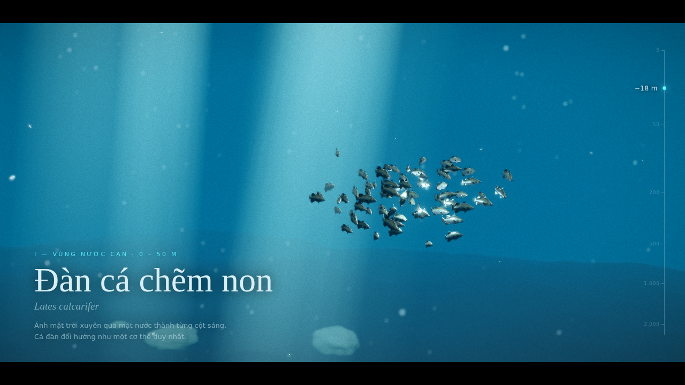
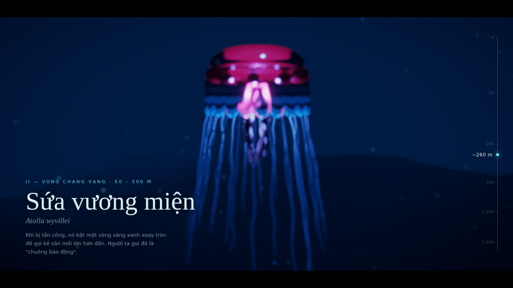
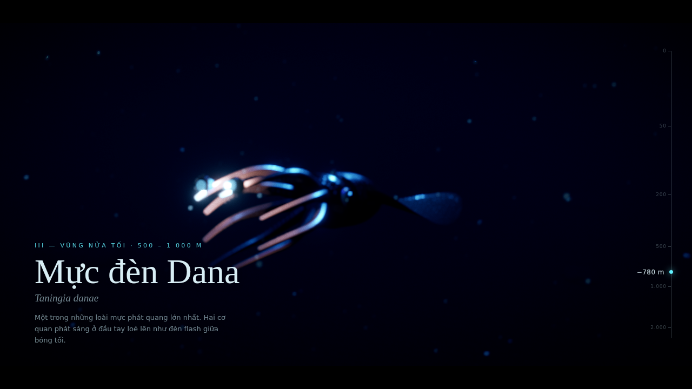
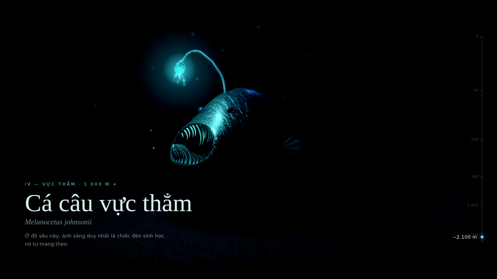
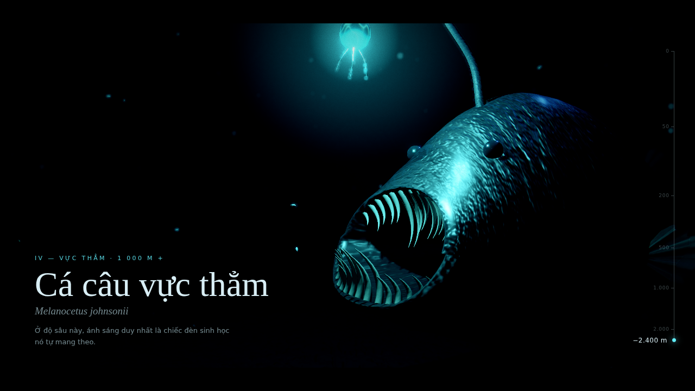
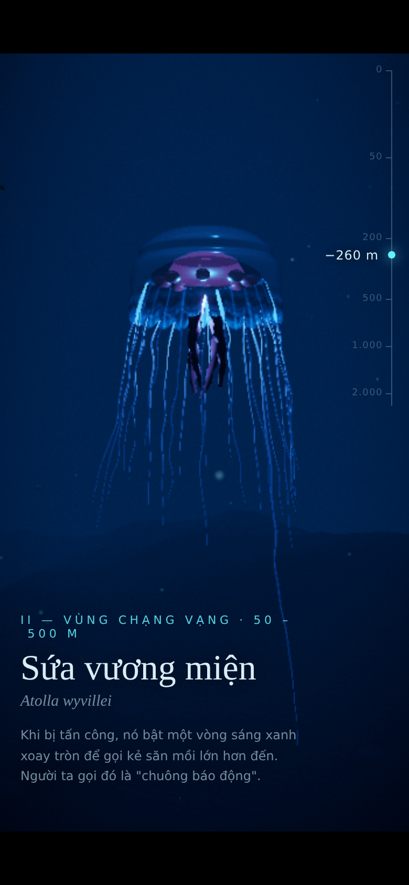
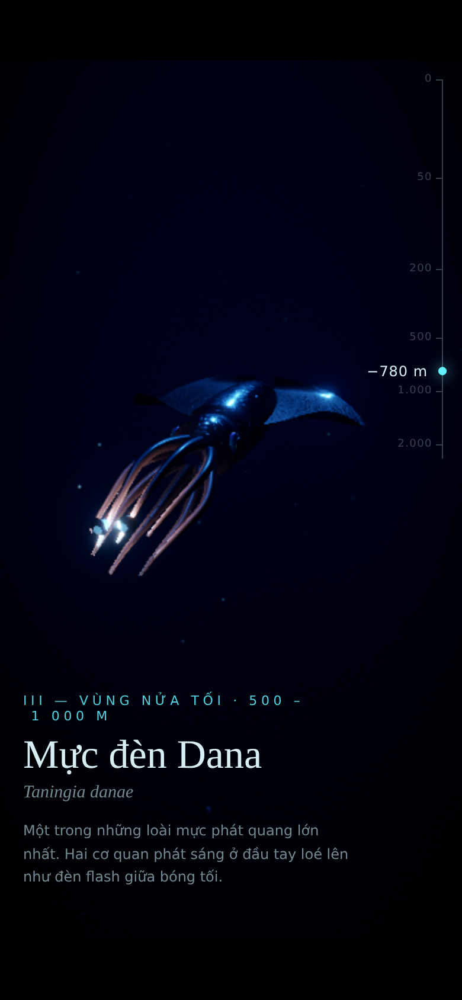
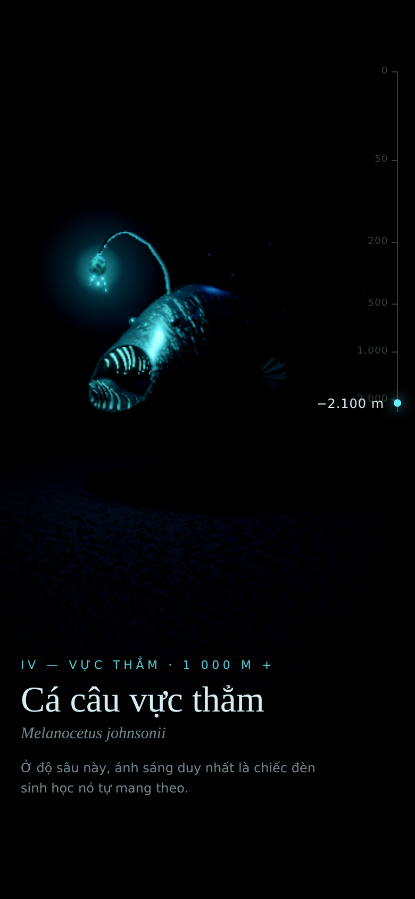

# Abyssal Light — Oceanic Cinema 3D

Một "thước phim tài liệu" 3D về sinh vật biển sâu phát quang, dựng bằng
Vite + React + TypeScript + React Three Fiber.

> **Trạng thái: hoàn thành (5 / 5)** — 4 cảnh, camera lặn theo scroll, animation
> procedural cho mọi sinh vật, hậu kỳ điện ảnh, tối ưu hiệu năng và di động.

| I · Nước cạn | II · Chạng vạng | III · Nửa tối | IV · Vực thẳm |
| --- | --- | --- | --- |
|  |  |  |  |



## Chạy

```bash
npm install
npm run dev          # http://localhost:5173
npm run build        # bản production trong dist/
```

Tham số URL hữu ích khi duyệt:

- `?p=0.65` — ghim camera tại một điểm trên đường lặn (0 = mặt nước, 1 = đáy)
- `?quality=low` / `?quality=high` — ép cấu hình di động / desktop
- `?motion=reduced` — giả lập `prefers-reduced-motion`

## Stack

| Việc                   | Thư viện                                          |
| ---------------------- | ------------------------------------------------- |
| Render                 | three r186, @react-three/fiber 9                  |
| Helper                 | @react-three/drei 10 (Environment, ContactShadows, useGLTF, useAnimations, useProgress…) |
| Hậu kỳ                 | @react-three/postprocessing 3 + postprocessing 6  |
| Camera theo scroll     | GSAP 3 + ScrollTrigger                       |
| State                  | Zustand 5                                         |

## Cuộc lặn

Một giá trị cuộn `p ∈ [0, 1]` (GSAP ScrollTrigger, `scrub`) điều khiển mọi thứ:

| p     | Cảnh | Độ sâu HUD | Sinh vật (key light) |
| ----- | ---- | ---------- | -------------------- |
| 0.10  | I — Vùng nước cạn    | 0–50 m     | Đàn cá chẽm non — mặt trời + ánh bạc phản chiếu theo đàn |
| 0.40  | II — Vùng chạng vạng | 50–500 m   | Sứa vương miện *Atolla wyvillei* — đèn trong chuông |
| 0.53–0.77 | III — Vùng nửa tối | 500–1000 m | Mực đèn Dana *Taningia danae* — 2 cơ quan phát sáng ở đầu tay (tracking shot) |
| 0.92  | IV — Vực thẳm        | 1000 m+    | Cá câu vực thẳm — đèn mồi |

- Bốn vùng xếp chồng theo trục Y (cách nhau 60 đơn vị); sương mù che vùng
  không ở gần camera.
- Camera: spline Catmull-Rom qua danh sách "cảnh quay"; các key "hold" dừng
  êm (ease in/out), đoạn giữa là cú lặn qua cột nước. Thêm lớp làm mượt
  (damping) và độ trôi nhẹ như hơi thở của thợ lặn. Cảnh III hoà trộn sang
  camera bám phía sau–bên trên con mực.
- Môi trường theo độ sâu (`lib/dive.ts`): màu/mật độ sương mù, hemisphere
  light (ánh sáng môi trường giảm dần và lạnh dần), cường độ environment map,
  độ sáng tuyết biển.
- `Zone`: giữ số lượng đèn cố định (không recompile shader khi lặn); đèn của
  vùng xa mờ về 0 và dừng cập nhật shadow map; mesh chuyển sang layer ẩn nên
  camera và shadow camera đều bỏ qua.
- `prefers-reduced-motion`: không bay camera — mỗi cảnh là một cú cắt tĩnh
  vào khung hình chính; sinh vật giữ tư thế tĩnh, đèn thở rất chậm.

## Độ mượt chuyển động

- Camera bám đường lặn bằng **lò xo giảm chấn tới hạn** (SmoothDamp) thay vì
  lerp: tăng tốc và hãm lại êm mỗi khi bắt đầu/dừng cuộn, không giật khi cuộn
  bằng bánh xe chuột từng nấc.
- Mọi phép làm mượt khác (nghiêng mình của cá và mực, đổi tiêu cự, lấy nét
  DoF) dùng damping theo thời gian thực, nên cảm giác như nhau ở 30, 60 hay
  144 Hz.
- Con mực có quán tính riêng dọc đường bơi (không nhảy theo từng nấc cuộn),
  camera tracking bám theo đúng vị trí đó.
- Không cấp phát bộ nhớ trong vòng lặp khung hình (tránh khựng do GC).

## Animation (procedural)

| Sinh vật | Chuyển động | Kỹ thuật |
| --- | --- | --- |
| Đàn cá chẽm | Mỗi con là một boid: tách đàn, căn hướng, tụ đàn + mục tiêu lang thang của cả đàn; giữ độ sâu, giới hạn góc ngóc ~20°, nghiêng mình khi rẽ, tốc độ và độ nhanh nhạy riêng | `lib/boids.ts` (Reynolds) + đuôi quẫy bằng vertex shader, tần số theo tốc độ từng con (`aPhase` instanced) |
| Sứa vương miện | Nhịp bơi: co nhanh – giãn chậm (3,2 s), lực đẩy lên rồi chìm dần; xúc tu là lò xo–giảm chấn trên từng đốt xương đuổi theo sóng sin chạy dọc xúc tu, loe ra khi co, xoè khi chìm; tay miệng uốn chậm; màn "chuông báo động" xoay vòng mỗi ~15 s | Vertex shader co chuông (mép co mạnh, đỉnh nhô) + chuỗi xương skinned + shader emissive xoáy |
| Mực đèn Dana | Vây quạt sóng chạy từ trước ra sau; áo mực co theo nhịp phụt nước; 8 tay lò xo–giảm chấn, khép khi phụt, xoè khi hồi, vung ngược chiều khi rẽ; thân nghiêng vào khúc cua; 2 cơ quan phát sáng chớp theo chuỗi | Vertex shader cho vây (kèm depth/distance material để bóng khớp) + bone scale/rotation |
| Cá câu | Đuôi uốn sóng qua 5 đốt sống, vây ngực quạt, cần câu đung đưa 2 khớp; mỗi 16 s: giật mồi → há miệng, lùi lại → đớp, lao tới | Keyframe track `[t, há, lao, quẫy]` nội suy lerp + easing (`lib/keyframes.ts`) |
| Model `.glb` người dùng | Phát clip khớp `swim/idle/move`, luân phiên các clip bằng `crossFadeTo` | drei `useAnimations` |

Camera giữ chủ thể trong khung: ở cảnh cá và cảnh sứa, điểm nhìn nhẹ nhàng
bám theo trọng tâm đàn cá / chuông sứa trong lúc dừng ở cảnh đó.

`prefers-reduced-motion`: đàn cá giữ đội hình tĩnh (không chạy boids), sứa
và mực đứng yên ở tư thế đẹp, cá câu không đớp mồi, đèn chỉ thở rất chậm.

## Khám phá, tương tác và âm nhạc

Mục tiêu: khiến người xem muốn ở lại và tự khám phá. **Nhật ký lặn** ghi lại
11 loài đã gặp (lưu trong trình duyệt), mỗi loài có thẻ với 2 sự thật đã
kiểm chứng.

| Tương tác | Cách hoạt động | Chi phí hiệu năng |
| --- | --- | --- |
| **Bắt đầu lặn** | Tải xong hiện nút; cú bấm đó bật luôn nhạc (quy định autoplay của trình duyệt). Có lựa chọn "Lặn không âm thanh" | — |
| **Chạm/bấm vào sinh vật** | Mở thẻ thông tin, loài mới được ghi vào nhật ký kèm tiếng chuông; vòng sáng gợi ý đánh dấu loài chưa gặp trong vùng đang xem | Không raycast: mỗi sinh vật đăng ký hình cầu bao (`interaction/discoverables.ts`), chỉ chiếu ~10 điểm khi có sự kiện con trỏ |
| **Chạm vào nước** | Một đám phù du phát quang bung ra (bong bóng bạc ở vùng nước cạn) kèm tiếng lấp lánh, rung nhẹ trên điện thoại | Pool cố định 8 × 140 hạt, 1 draw call; mỗi lần chạm chỉ ghi uniform (`scene/GlowBursts.tsx`) |
| **Đèn pin thợ lặn** | Con trỏ chuột là một luồng sáng: tuyết biển và sứa sáng lên, bị đẩy dạt ra; đàn cá mồi và cá đèn tách ra; đàn cá chẽm (boids) né tránh | Không phải đèn three.js: 2 uniform dùng chung cho các shader tự viết (`interaction/diverLight.ts`) |
| **Cá voi lưng gù (loài bí mật)** | Giữa vùng nắng và vùng chạng vạng, một con cá voi bơi ngang qua tầm nhìn và cất tiếng hát | Chỉ tồn tại trong đoạn đó; bơi bằng vertex shader |
| **Điều hướng chương** | Các chấm trên thước độ sâu: bấm để lặn thẳng tới vùng | — |
| **Chỉ số sống** | Áp suất, nhiệt độ, % ánh nắng còn lại theo độ sâu | Chỉ đổi `textContent` khi độ sâu đổi |
| **Kết thúc** | Ở đáy: tổng kết số loài đã gặp, nút "Lặn lại từ đầu" và "Mở nhật ký lặn"; gặp đủ 11/11 thì mọi nguồn phát quang cùng loé sáng | — |

### Âm nhạc tạo bằng code (`audio/OceanAudio.ts`)

Web Audio tự sinh nhạc ambient, **0 KB tải về**, đổi theo độ sâu:

- **Nước cạn:** pad sáng (thang Lydian), chuông thuỷ tinh theo âm giai ngũ cung, tiếng sóng.
- **Chạng vạng:** pad lơ lửng, tiếng cá voi xa xăm (sóng răng cưa trượt cao độ qua bộ lọc formant).
- **Nửa tối:** pad thứ, tiếng ping sonar có vọng.
- **Vực thẳm:** drone trầm, nhịp tim chậm, tiếng kẽo kẹt hiếm hoi.
- Âm vang dùng một impulse tạo một lần; hợp âm đổi mỗi 16 giây.
- Hiệu ứng âm thanh riêng cho: khám phá, phát quang, bong bóng khi lặn nhanh, mở/đóng thẻ, hoàn thành nhật ký.

Hiệu năng: mọi thứ chạy trên luồng audio riêng. Luồng chính chỉ lên lịch vài
nốt mỗi 200 ms và cập nhật độ sâu 10 lần/giây. Âm thanh tự tạm dừng khi tab ẩn
hoặc khi tắt tiếng.

Muốn dùng nhạc của riêng bạn: thả `ambient.mp3` hoặc `zone-0.mp3` … `zone-3.mp3`
vào `public/audio/` (xem README trong đó).

### Đo hiệu năng

Harness Playwright + SwiftShader (render bằng CPU, nhiễu ±10–15 %), cùng máy,
cùng thời gian chờ, rê chuột liên tục trong lúc đo. Thời gian mỗi khung (ms),
trước và sau khi thêm lớp khám phá:

| Cảnh | Trước | Sau |
| --- | --- | --- |
| I · Nước cạn | 762 | 808 |
| II · Chạng vạng | 589 | 583 |
| III · Nửa tối | 735 | 643 |
| IV · Vực thẳm | 622 | 608 |

Chênh lệch nằm trong biên nhiễu. Chú ý: không dùng `backdrop-filter` trên UI luôn
hiển thị (nó phải làm mờ lại canvas mỗi khung); thẻ và nhật ký chỉ bật blur
khi đang mở.

## Dàn diễn viên phụ (GPU-animated)

Mỗi cảnh có thêm sinh vật nền. Toàn bộ chuyển động của chúng là hàm của
`(uTime, thuộc tính riêng từng con)` tính trong vertex shader (`lib/gpuSwarm.ts`):
**một draw call mỗi loài, không có vòng lặp JS nào theo từng con**. Mỗi khung
chỉ ghi đúng một uniform `uTime`.

| Cảnh | Loài | Số lượng (desktop / di động) | Chuyển động |
| --- | --- | --- | --- |
| I | Đàn cá mồi (bait ball) | 180 / 70 | Xoáy thành cột, con trong bơi nhanh hơn con ngoài, quẫy đuôi, lấp lánh ánh kim |
| I | Cá voi lưng gù (bí mật) | 1 | Bơi ngang qua tầm nhìn giữa vùng I và II, vây ngực dài uốn chậm |
| I | Cá đuối manta | 1 | Lượn vòng trên cao, cánh vỗ thành sóng từ thân ra mép (vertex shader) |
| II | Sứa nhỏ phát quang | 18 / 8 | Mỗi con co bóp theo nhịp riêng, xúc tu trôi theo sau, rìa chuông sáng (Fresnel) |
| III | Cá đèn (lanternfish) | 120 / 45 | Bơi thành đàn theo vệt của con đầu đàn, hàng photophore dưới bụng phát sáng |
| IV | Sứa lược (ctenophore) | 7 / 3 | Tám hàng lông bơi tạo cầu vồng chạy dọc thân, xoay chậm |
| IV | Lông biển (sea pen) | 22 / 9 | Đung đưa trong dòng chảy, các polyp loé sáng thành sóng chạy dọc thân |

`?cast=0` ẩn dàn diễn viên phụ để so sánh hiệu năng A/B.

## Hậu kỳ (post-processing)

`scene/PostFX.tsx` — `EffectComposer` render HDR tuyến tính (tone mapping của
renderer tắt), theo thứ tự:

1. **DepthOfField** — tự lấy nét vào sinh vật của cảnh hiện tại (trọng tâm
   đàn cá, chuông sứa, thân mực, mặt cá câu); vùng nét tính theo đơn vị thế
   giới đủ rộng để cả con vật sắc nét, nước phía sau tan thành bokeh. Chuyển
   nét mượt, cắt thẳng khi đổi vùng.
2. **Bloom** (mipmap blur) — ngưỡng cao để chỉ những điểm thực sự quá sáng
   (bầu mồi, cơ quan phát sáng, vành chuông sứa, mặt nước) "nở" ra; cường độ
   tăng theo độ sâu.
3. **FilmGradeEffect** (tự viết) — exposure theo độ sâu, tone mapping ACES,
   split-toning bóng tối xanh lục/đậm – vùng sáng xanh ngọc, contrast và
   độ bão hoà giảm dần, mức đen bị nén về gần đen ở vực thẳm.
4. **ChromaticAberration** rất nhẹ (tăng dần ra mép), **Vignette** đậm dần theo
   độ sâu, **Noise** (film grain) mức thấp.

## Hiệu năng & responsive

- **Tự phát hiện cấu hình:** màn hình cảm ứng nhỏ hoặc `deviceMemory ≤ 4` →
  `quality = low`: ~⅓ hạt tuyết biển, ít cột sáng/đá/cá hơn, shadow map
  512–1024, tắt đổ bóng đèn rim, tắt `transmission` (vật liệu trong suốt
  dùng alpha), texture da 512 px, lưới thưa hơn, không DoF, không MSAA.
- **`PerformanceMonitor`** (drei) đo FPS liên tục: độ phân giải (DPR) trượt
  giữa min–max theo FPS (bắt đầu ở 1, tối đa 1,5); nếu vẫn không giữ nổi → tắt DoF.
- **Vùng ngoài khung hình không tốn CPU:** mô phỏng boids, lò xo xúc tu, tay
  mực… chỉ chạy khi vùng đó đang hiện; vùng ẩn còn bỏ qua cập nhật ma trận
  thế giới (hàng trăm đốt xương). Tuyết biển (cả mảnh vụn nhận bóng) chạy hoàn
  toàn trên GPU.
- **Chỉ một vùng được chiếu sáng tại một thời điểm:** đèn của vùng không
  xem bị tắt hẳn (`visible = false`), nên mỗi pixel chỉ tính 4–6 đèn và 1
  shadow map thay vì 16 đèn / 6 shadow map. Đèn của vùng cũ mờ về 0 đúng ở
  điểm giữa hai vùng rồi mới đổi, nên không thấy "giật" ánh sáng.
- **Biên dịch shader trước:** mỗi vùng là một cấu hình đèn khác nhau (một
  biến thể shader khác). `ShaderPrewarm` biên dịch sẵn cả 4 cấu hình bằng
  `compileAsync` trong lúc màn hình tải còn hiện — không còn khựng khi lặn
  sang vùng mới.
- **Transmission** chỉ còn ở chuông sứa (render ở ½ độ phân giải); các phần
  trong suốt khác dùng alpha. Shadow map đèn điểm 512 px, cập nhật mỗi 2
  khung; mỗi vùng chỉ 1 đèn đổ bóng.
- **Hình học vừa đủ:** đá 1 280 tam giác/viên (trước 20 480), lưới đáy biển
  thưa hơn; cảnh sứa từ ~330k xuống ~170k tam giác.
- **Hậu kỳ gọn:** không MSAA trên buffer HDR (dùng FXAA gộp vào pass hiệu
  ứng), DoF ở 0,4 độ phân giải, bloom 6 mức. Mesh vùng xa vẫn nằm trên layer
  ẩn (camera + shadow camera bỏ qua); `ContactShadows` chỉ mount ở cảnh đang
  xem. `?fx=0` tắt hậu kỳ để đo.
- **Asset:** model cá 12,5 MB → 239 KB (WebP 512 px) và được inline; mọi
  texture khác bake procedural lúc tải (không có request mạng nào ngoài font).
  Build một file JS ~1,9 MB (≈675 KB gzip).
- **Tràn viền:** không letterbox, không thanh cuộn — canvas phủ toàn bộ khung
  nhìn; chữ chỉ giữ khoảng cách an toàn với mép (kể cả tai thỏ/safe-area).
- **Màn hình dọc:** khung hình được thiết kế cho ~16:9; trên màn hẹp camera
  vừa mở ống kính vừa lùi lại (giữ không gian ngang cho sinh vật) và hạ điểm
  nhìn để sinh vật nằm ở nửa trên, nhường phần dưới cho thẻ chương. Canvas
  `pointer-events: none` nên vuốt trên điện thoại luôn cuộn trang.
- **`prefers-reduced-motion`:** không bay camera (cắt thẳng vào khung hình
  chính từng cảnh), không boids, sinh vật đứng yên ở tư thế đẹp, đèn thở rất
  chậm, UI không chuyển động — vẫn đủ ánh sáng, bóng đổ và hậu kỳ.

| Điện thoại · Chạng vạng | Điện thoại · Nửa tối | Điện thoại · Vực thẳm |
| --- | --- | --- |
|  |  |  |

## Cấu trúc

```
src/
  creatures/
    CreatureModel.tsx          # loader .glb chung: chuẩn hoá scale, shadow, crossfade clip
    anglerfish/                # cá câu procedural có bộ xương (thân loft + khoang miệng)
    jellyfish/                 # sứa vương miện: chuông mesoglea kín, 23 xúc tu + 4 tay miệng trên chuỗi xương
    squid/                     # mực đèn Dana: áo + vây lớn, 8 tay có móc, 2 cơ quan phát sáng
    fish/FishSchool.tsx        # đàn cá instanced từ BarramundiFish.glb
  scenes/                      # ShallowsScene, TwilightScene, MidnightScene, AbyssScene (+ shallows/ mặt nước, god rays)
  lib/
    noise.ts                   # Perlin 3D, fBm, ridged, profile spline
    geometry.ts                # taperedTube (ống thuôn theo đường cong), fanFin (vây xếp nếp)
    textures.ts                # bake map PBR trên CPU: da, vây, emissive mồi, trầm tích
    bioluminescence.ts         # hàm nhịp sáng sinh học + registry nguồn sáng
    models.ts                  # danh sách sinh vật + tra cứu .glb người dùng
    useProcedural.ts           # build asset procedural trong Suspense + báo tiến độ
    dive.ts                    # p → độ sâu, vùng, môi trường, đường bơi của mực, chương
    boids.ts                   # bầy đàn Reynolds cho cá
    deform.ts                  # biến dạng vertex áp cả cho depth/distance material (bóng khớp)
    keyframes.ts               # track keyframe nội suy (cú đớp của cá câu)
    caustics.ts                # vân sáng caustic trên cát (chỉ dưới nắng, mất trong bóng)
  scene/
    Experience.tsx             # Canvas, renderer, shadow map
    CameraRig.tsx              # GSAP ScrollTrigger → spline camera + tracking shot
    Atmosphere.tsx             # sương mù / ánh sáng môi trường / env map theo độ sâu
    Zone.tsx                   # bật/tắt một vùng mà không đổi số lượng đèn
    AimedLight.tsx             # spot/directional có target nằm trong scene graph
    PostFX.tsx                 # bloom, DoF, grade, vignette, CA, grain
    BioLight.tsx               # PointLight phát quang: nhấp nháy, đổ bóng mềm
    DeepEnvironment.tsx        # environment map xanh sâu (HDR cube dựng bằng Lightformer)
    Seabed.tsx                 # đáy biển displace + đá procedural
    MarineSnow.tsx             # tuyết biển: điểm GPU sáng lên gần nguồn phát quang + mảnh vụn nhận bóng
  state/                       # Zustand: scene/chất lượng/reduced-motion, tiến độ tải
  ui/                          # Loader (tiến độ thật), mở đầu, thẻ chương, thước đo độ sâu
```

## Model 3D & license

Mạng của môi trường dựng chỉ truy cập được GitHub/npm (Sketchfab, Poly Haven,
Quaternius bị chặn), và không có mô hình cá câu/sứa/mực CC0 nào tải được từ
đó. Vì vậy các sinh vật được **tự dựng bằng procedural geometry nâng cao**
(không phải hình khối cơ bản):

- **Cá câu vực thẳm** — một bề mặt loft liên tục đi từ da ngoài → môi cuộn →
  khoang miệng → họng kín (miệng mở có chiều sâu thật). Silhouette theo
  spline đơn điệu, displace hữu cơ bằng fBm + ridged noise. Bộ xương sinh tự
  động (5 đốt sống + hàm) với trọng số skin mượt. Răng/cần câu/sợi phát quang
  là `taperedTube` theo đường cong Bézier/Catmull-Rom; vây là màng xếp nếp
  theo tia vây với alpha map rách mép; bầu mồi là `LatheGeometry` hình giọt.
- Vật liệu `MeshPhysicalMaterial`: da có clearcoat (nhớt ướt) + sheen (nhung)
  + normal/roughness map bake procedural; vây, răng và bầu mồi dùng
  `transmission + thickness + attenuationColor` để giả lập tán xạ dưới bề mặt;
  bầu mồi có **emissive map riêng** (lõi phát quang + mạch dẫn sáng).

Nguồn model đã xác định cho các bước sau:

| Sinh vật           | Nguồn                                                                 | License |
| ------------------ | --------------------------------------------------------------------- | ------- |
| Cá chẽm (cảnh 1)   | [BarramundiFish — Khronos glTF-Sample-Assets](https://github.com/KhronosGroup/glTF-Sample-Assets/tree/main/Models/BarramundiFish) (Microsoft). Đã tối ưu: texture 512 px WebP (12.5 MB → 239 KB), `src/assets/barramundi.glb` | CC0 1.0 |
| Cá câu, sứa, mực   | Procedural (dự án này)                                                | —       |
| Environment map    | Procedural (Lightformer → cube map HDR)                               | —       |

### Dùng model .glb của bạn

Thả file vào `public/models/` với tên trùng id sinh vật — scene tự load và
thay model mặc định (dev server tự reload khi thêm/xoá file):

| File              | Sinh vật                 |
| ----------------- | ------------------------ |
| `anglerfish.glb`  | Cá câu vực thẳm (cảnh 4) |
| `jellyfish.glb`   | Sứa (cảnh 2)             |
| `squid.glb`       | Mực khổng lồ (cảnh 3)    |
| `fish.glb`        | Cá trong đàn (cảnh 1)    |

Riêng `fish.glb` được vẽ instanced cho cả đàn (dùng mesh đầu tiên, trục dài
nhất làm thân cá). Các model khác được tự chuẩn hoá kích thước, bật `castShadow/receiveShadow`, phát
animation clip khớp `swim|idle|move` (crossfade). Nếu model có node tên chứa
`lure|esca|glow|light|bulb`, đèn phát quang sẽ gắn vào node đó.

## Ánh sáng & bóng

- `renderer.shadowMap.enabled = true`. **Lưu ý:** three r182+ đã bỏ
  `PCFSoftShadowMap` (gán vào sẽ bị cảnh báo và tự chuyển sang
  `PCFShadowMap`). `PCFShadowMap` hiện lọc mềm bằng Vogel-disk theo
  `shadow.radius`, nên dự án dùng trực tiếp `PCFShadowMap` + `shadow.radius`
  để có bóng mềm.
- Key light = `PointLight` nằm **bên trong bầu mồi**, nhấp nháy theo nhịp sinh
  học (`bioPulse`), đổ bóng mềm (cube shadow map). Fill xanh lạnh không đổ
  bóng; rim ngược sáng xanh đậm có đổ bóng. `ContactShadows` dưới sinh vật.
